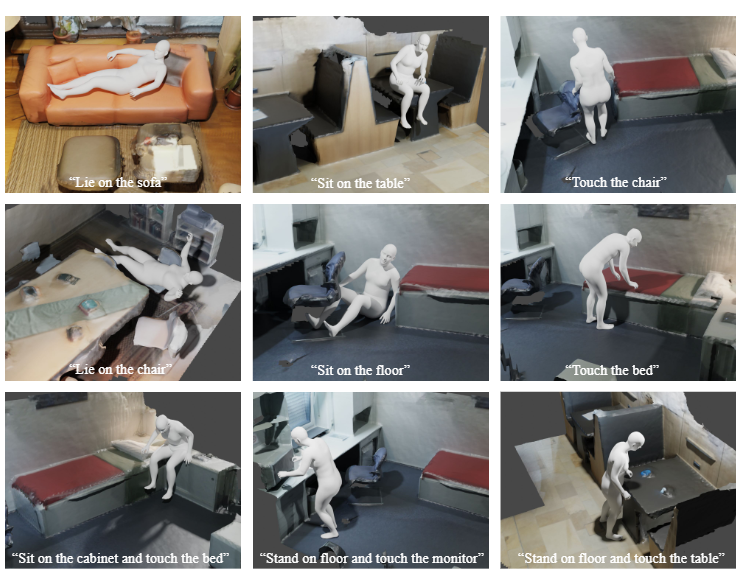
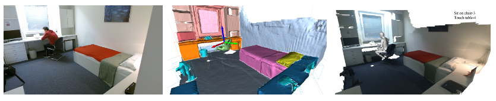

# Compositional Human-Scene Interaction Synthesis with Semantic Control (COINS)
This repository contains the implementation of our paper Compositional Human-Scene Interaction Synthesis with Semantic Control and the PROX-S dataset expansion.

You can find more information on our [project page](https://zkf1997.github.io/COINS/index.html).
## Installation
This implementation is tested on the following platform:
```
Python 3.7, PyTorch 1.11.0 with CUDA 11.3 and cuDNN 8.2.0, PyTorch3D 0.6.2, Ubuntu 20.04
``` 
We recommend to manage the dependencies using conda.
Please first install CUDA and ensure NVCC works. 
You can then create a conda environment using provided yml file as following:
```
conda env create -n COINS -f environment.yml
```
External data files:
* To use the SMPL-X body models, please download the weights from [SMPL-X website](https://smpl-x.is.tue.mpg.de/index.html) and set `smplx_model_folder` in [config](configuration/config.py).
* Please download [POSA](https://posa.is.tue.mpg.de/index.html) and extract the `mesh_ds` for body mesh downsampling. Please set `mesh_ds_folder` in [config](configuration/config.py) accordingly.

(Optional): If you want off-screen image rendering from SSH session or in a headless server, please install `osmesa` and set OpenGL at the start of scripts as following:
```
os.environ['PYOPENGL_PLATFORM'] = 'osmesa' 
```
## PROX-S dataset

The PROX-S dataset is a human-scene interaction dataset annotated on top of [PROX](https://prox.is.tue.mpg.de/index.html) and [PROX-E](https://github.com/yz-cnsdqz/PSI-release), which contains:
* scene instance segmentation
* per-frame interaction semantic labels and SMPL-X body estimation

You can download PROX-S expansion [here](https://drive.google.com/drive/folders/1nV_S_m0Yl8p3sOaCLpz5IIZxoL4_TAtE?usp=sharing).
Please also download `scenes`, `sdf`, and `body_segments` from [PROX](https://prox.is.tue.mpg.de/index.html), `scenes_semantics` from [PROX-E](https://github.com/yz-cnsdqz/PSI-release), and set the paths in [config](configuration/config.py). 

You can render scene segmentation and log object instances by:
```
cd data; python scene.py
```
Regarding interaction data with semantic labels, we provide a script [load_interaction](data/load_interaction.py) to load interaction data of specific action or action-object pair, and visualize the interaction with object instances.

## Pre-trained Models
We provide the pre-trained models for BodyVAE and PelvisVae [here](https://drive.google.com/drive/folders/1nV_S_m0Yl8p3sOaCLpz5IIZxoL4_TAtE?usp=sharing).
Please set `checkpoint_folder` in [config](configuration/config.py).

## Interaction synthesis in PROX scenes
For synthesizing interactions with semantic control, please run [two_stage_sample](interaction/two_stage_sample.py) as following:
```
cd interaction
# sample interactions
python two_stage_sample.py --exp_name test --lr_posa 0.01 --max_step_body 100  --weight_penetration 20 --weight_pose 10 --weight_init 0.01  --weight_contact_semantic 1 --num_sample 8 --num_try 1  --visualize 1 --full_scene 1 --interaction 'sit on-chair' --scene_name 'MPH16'
# compositional interaction synthesis
python two_stage_sample.py --exp_name test --lr_posa 0.01 --max_step_body 100  --weight_penetration 20 --weight_pose 10 --weight_init 0.01  --weight_contact_semantic 1 --num_sample 8 --num_try 1  --visualize 1 --full_scene 1 --interaction 'sit on-chair+touch-table' --scene_name 'MPH16' --composition 1 
```
The synthesized results can be found in `./results/two_stage`.
Currently, the script supports choosing PROX scenes by `--scene_name` and interaction by `--interaction` in the format of `action1-object1[+action2-object2]`. The script iterates over all instances of specified category in the input scene and generates interactions for each action-instance pair.

You may freely manipulate the weights.

## Training
We use [PyTorch Lightning](https://www.pytorchlightning.ai/) for model training. Please refer to its documentation if you want to customize trainer features such as logging, checkpoint, resume training, etc. 

To train BodyVAE, please run:
```
cd interaction; python interaction_trainer.py --expr_name two_contact --model InteractionVAE --weight_kl 1 --used_interaction 'all' --robust_kl 1 --batch_size 8 --latent_dim 128 --num_obj_points 8192 --num_obj_keypoints 256 --use_pointnet2 1 --body_type mesh --template_type tpose --use_annealing 1 --latent_usage memory --second_stage 2 --use_contact_feature 1 --weight_contact_rec 1 --weight_contact_dist 1 --weight_normal 0.1 --weight_edge_length 0.2 --relative_length 1 --data_overwrite 0 --include_motion 1 --weight_normal_consistency 0.05 --use_regressor 1 --contact_scene_thresh 0.01 --contact_semantic_thresh 0.05 
```

To train PelvisVAE, please run:
```
cd interaction; python transform_trainer.py --expr_name floor_all --model InteractionVAE --weight_kl 1 --weight_pelvis 3 --weight_orient 1 --weight_dist 1 --weight_coord 1 --weight_penetration 3  --used_interaction 'all' --use_annealing 0 --robust_kl 1 --batch_size 8 --use_augment 1 --thresh_penetration 0.25 --second_stage 10 --num_obj_keypoints 256 --num_obj_points 8192 --num_layers 2 --embedding_dim 64 --latent_dim 6 --use_prox_single 1 --include_motion 1 --use_annotate 0 --data_overwrite 0 --use_pointnet2 1 --use_floor_height 1
```
The trained models with logs can be found in `./results/interaction` and `./results/transform`. You can set `--debug 1` to render samples for inspection during training.

## License
We employ MIT license for this repository, with the exceptions of codes borrowed or modified from other works:
* [mpcat40.tsv](./configuration/mpcat40.tsv) from [Matterport](https://github.com/niessner/Matterport/blob/master/metadata/mpcat40.tsv).
* [smplx_vert_segmentation.json](./configuration/smplx_vert_segmentation.json) from [Meshcapade](#https://github.com/Meshcapade/wiki/blob/main/assets/SMPL_body_segmentation/smplx/smplx_vert_segmentation.json).
* [chamfer_distance.py](interaction/chamfer_distance.py) from [Pytorch3D](https://pytorch3d.org/). 
* [loss.py](interaction/loss.py) from [Pose2Mesh](https://github.com/hongsukchoi/Pose2Mesh_RELEASE/blob/master/lib/core/loss.py).
* [mesh.py](interaction/mesh.py), [posa_utils](interaction/posa_utils.py), [viz_utils](interaction/viz_util.py) from [POSA](https://posa.is.tue.mpg.de/index.html).
* [eulerangles.py](interaction/eulerangles.py) from [transforms3d](https://github.com/matthew-brett/transforms3d/blob/master/transforms3d/euler.py).
* [pointnet2.py](interaction/pointnet2.py) from [pointnet_pointnet2](https://github.com/yanx27/Pointnet_Pointnet2_pytorch/blob/master/models/pointnet2_utils.py).
* [smplx_regressor.py](interaction/smplx_regressor.py) from [GraphCMR](https://github.com/nkolot/GraphCMR).
* [transformer.py](interaction/transformer.py) from [pytorch](https://pytorch.org/docs/stable/_modules/torch/nn/modules/transformer.html#Transformer). 

We sincerely thank the authors for releasing the codes and please check their respective licenses for these parts.